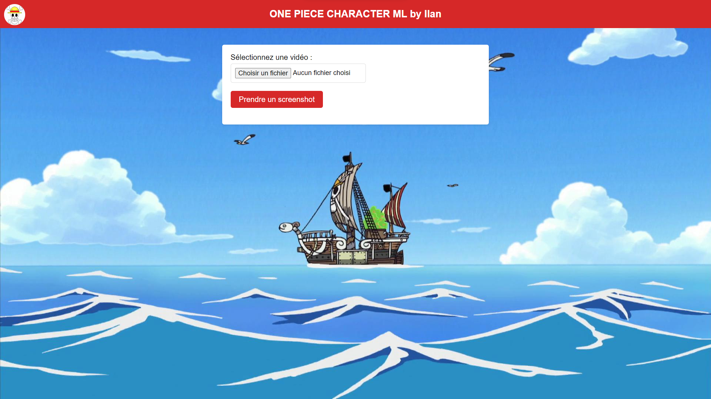
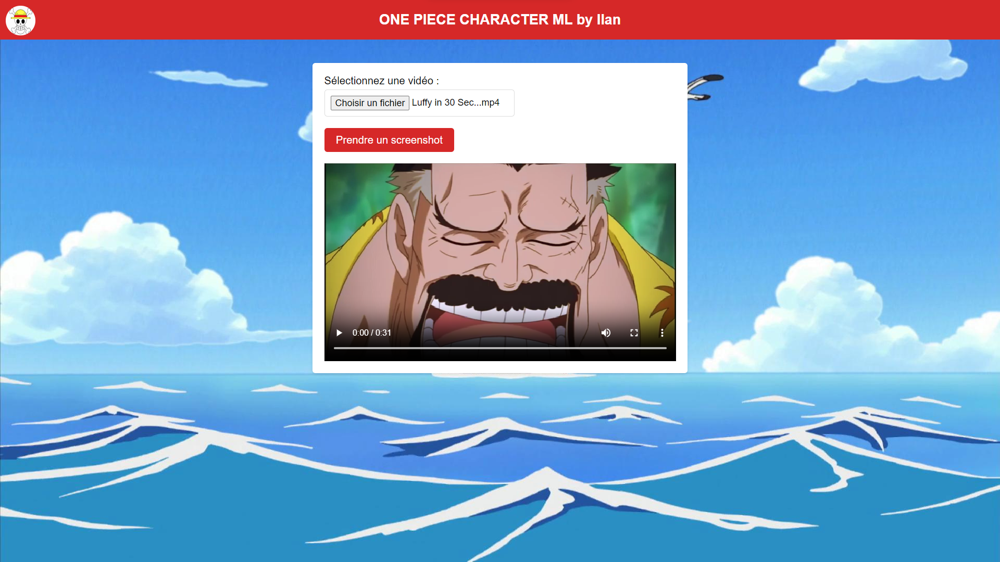
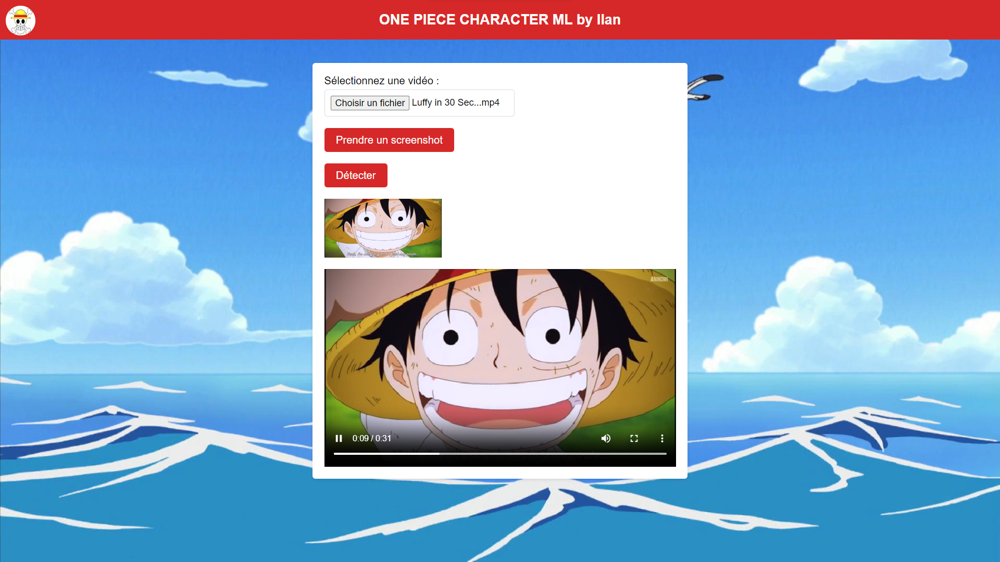
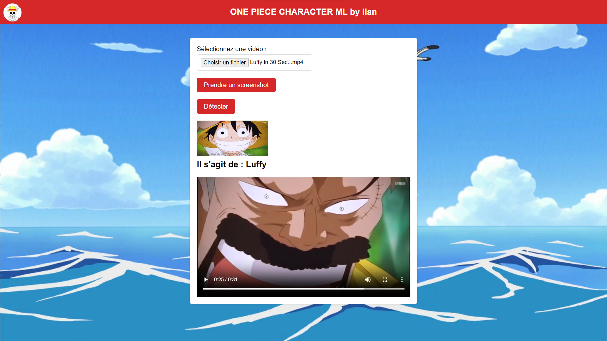

# 🏴‍☠️ One Piece Character Recognition 

## 🌊 Introduction
This web application harnesses the capabilities of a deep learning model (CNN) to detect characters from One Piece video clips or episodes. Load a video, capture the desired scene, and get the character recognition results.

## 🧭 1 - First Glance 🌅

## 📺 2 - Loaded Video 🎥

## 📸 3 - Screenshot Capture 🖼

## 🕵️‍♂️ 4 - Character Detection 🔍

## 🏴‍☠️
